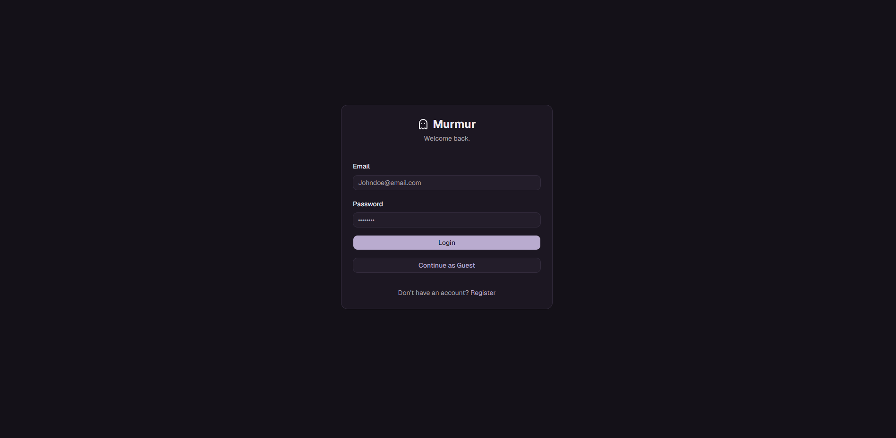
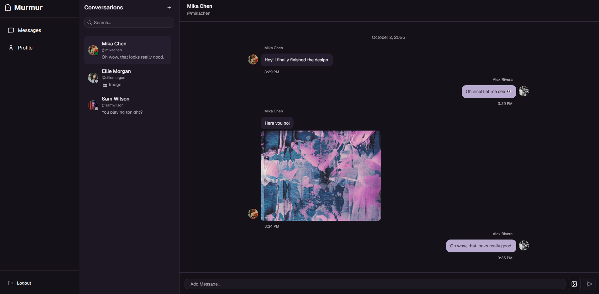
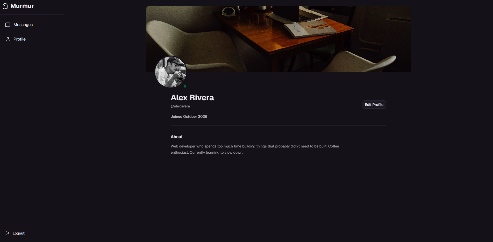
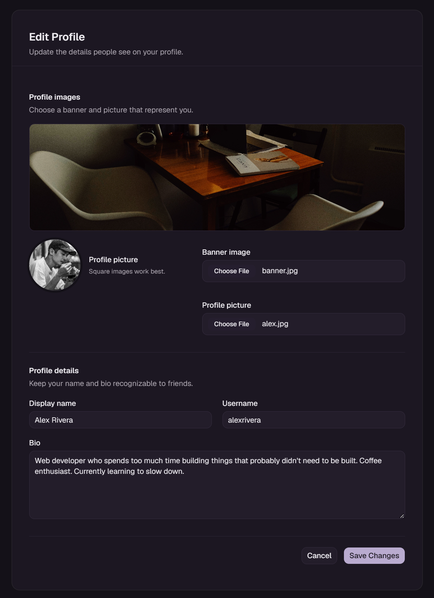
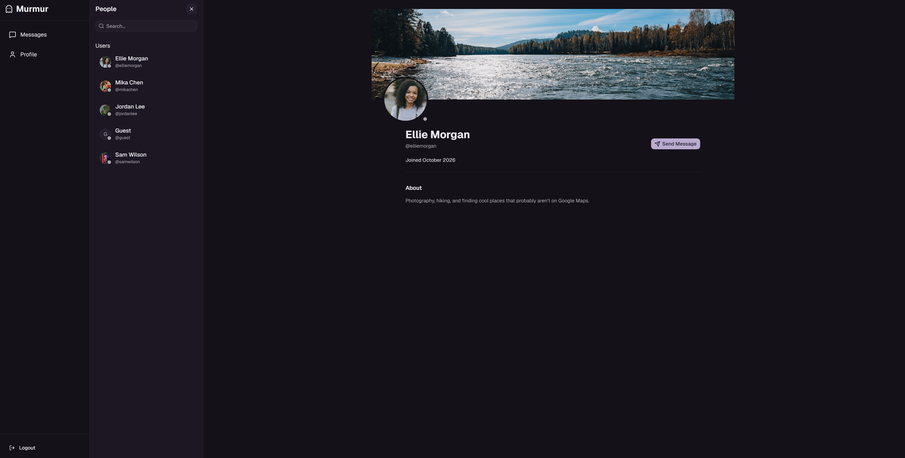
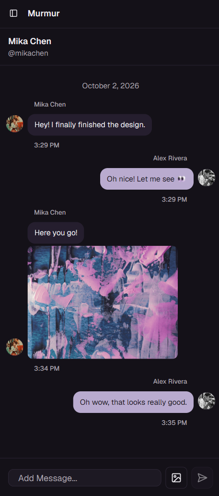

# Murmur

# Murmur

Murmur is a private, one-to-one messaging app for connecting people through direct conversations. The project brings together a responsive React client, an authenticated Express API, PostgreSQL persistence, and hosted image uploads.

**Live Demo:** [Murmur](https://murmur-sable.vercel.app/)

## Project Overview

Murmur was built to explore a complete messaging workflow across a modern frontend and backend: account sessions, conversation and message APIs, relational data modeling, and user-uploaded media. The goal is a focused messaging experience that includes the surrounding profile and account flows needed to make conversations usable.

## Key Features

- Register, log in, log out, restore an authenticated session, and use guest login when a demo account is configured.
- Start and manage one-to-one conversations, with the latest active conversation shown first.
- Send text messages and image attachments; the conversation view displays message senders, timestamps, and attached images.
- Browse other users, view profiles, and start a conversation from a profile.
- Edit a profile's username, display name, bio, avatar, and banner.
- Show online status based on periodic presence heartbeats and the user's last-seen time.
- Use responsive layouts for the conversation list, messaging view, and profile screens.

## Tech Stack

### Frontend

- React 19 and React DOM
- Vite 8
- React Router
- Tailwind CSS 4
- Zustand for client-side state

### Backend

- Node.js with Express 5
- PostgreSQL
- Prisma ORM with the PostgreSQL adapter
- Cloudinary for uploaded images

## Libraries & Tools

- **UI:** Base UI, shadcn component tooling, Lucide icons, Geist Variable font, `class-variance-authority`, `clsx`, and `tailwind-merge`.
- **API and security:** `cors`, `cookie-parser`, `helmet`, `express-rate-limit`, `jsonwebtoken`, and `bcryptjs`.
- **Uploads:** `multer` for multipart form handling and `file-type` for checking uploaded image contents.
- **Database:** Prisma CLI and client, `@prisma/adapter-pg`, and `pg`.
- **Development and tests:** ESLint, Prettier, Nodemon, Vitest, and Supertest.

## Screenshots

<!-- Add the main/home messaging screen screenshot at docs/screenshots/home-messaging.png. -->













## How It Works

The React client calls the Express API over HTTP and sends credentials with its requests. The API authenticates protected requests using a JWT in an HTTP-only cookie, then uses Prisma and the PostgreSQL adapter to read and write users, conversations, and messages in PostgreSQL.

For image uploads, the API receives the file in memory, checks its detected image type, then streams it to Cloudinary. The database stores the resulting image URL with the message or profile record. The app uses periodic HTTP heartbeats for last-seen presence; messaging is handled through the API rather than a WebSocket connection.

## Local Development

### Requirements

- Node.js and npm
- A PostgreSQL database for development
- A Cloudinary account for message and profile image uploads

### Setup

1. Install the client and server dependencies:

   ```sh
   cd client
   npm install
   cd ../server
   npm install
   ```

2. Create `server/.env` from `server/.env.example`. Set `DATABASE_URL` to the development PostgreSQL connection string, choose a strong `JWT_SECRET`, keep `DEV_FRONTEND_URL` at `http://localhost:5173`, and add the Cloudinary cloud name, API key, and API secret. `PORT` can be set to `3000` or omitted to use the server default.

   ```sh
   cp .env.example .env
   ```

   On PowerShell, use `Copy-Item .env.example .env` instead of `cp`.

3. From the `server` directory, apply the development migrations:

   ```sh
   npm run prisma:migrate
   ```

4. Create `client/.env` from `client/.env.example`. Set `VITE_API_URL` to the local API origin:

   ```env
   VITE_API_URL=http://localhost:3000
   ```

5. Start the API and client in separate terminals:

   ```sh
   cd server
   npm run dev
   ```

   ```sh
   cd client
   npm run dev
   ```

   Vite uses `http://localhost:5173`; the API defaults to `http://localhost:3000`.

To run the server tests, configure `TEST_DATABASE_URL` in `server/.env` to a separate test database, then run `npm test` from `server`. The test command applies the existing migrations to that database before running Vitest. Build the client with `npm run build` from `client`.

## Production Deployment

Murmur is deployed with:

- **Frontend:** Vercel
- **Backend:** Render
- **Database:** Neon PostgreSQL
- **Image storage:** Cloudinary

The Vercel frontend uses `VITE_API_URL` to communicate with the deployed Express API. The Express API connects to Neon through `DATABASE_URL` and uses Cloudinary for uploaded images.

The client includes a Vercel rewrite configuration so React Router routes resolve correctly when accessed directly or refreshed.

Production secrets and database credentials are stored in the hosting providers' environment variables and are not committed to the repository.

## What I Learned

The implementation covers several practical full-stack concepts: coordinating React state with REST endpoints, protecting API routes with cookie-based JWT sessions, modeling relational data with Prisma, applying schema migrations, validating multipart uploads, and keeping uploaded media in Cloudinary while storing its URL in PostgreSQL. It also demonstrates how CORS and cookie settings connect a separately hosted client and API.

## Future Improvements

- Add WebSocket-based delivery for new messages and presence updates.
- Add read receipts, typing indicators, and delivery state.
- Add message pagination and conversation history search.
- Add group conversations and controls for managing conversation membership.